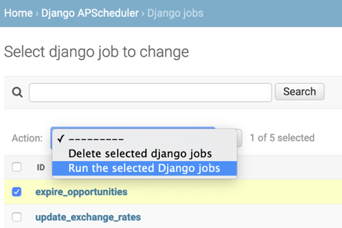

Django APScheduler
==================

[](https://badge.fury.io/py/django-apscheduler)
[](https://pypi.org/project/django-apscheduler)
[](https://pepy.tech/project/django-apscheduler)
[](https://travis-ci.org/jarekwg/django-apscheduler)
[](https://codecov.io/gh/jarekwg/django-apscheduler)
[](https://pypi.org/project/black)

[APScheduler](https://github.com/agronholm/apscheduler) for [Django](https://github.com/django/django).

This is a Django app that adds a lightweight wrapper around APScheduler. It enables storing persistent jobs in the
database using Django's ORM.

django-apscheduler is a great choice for quickly and easily adding basic scheduling features to your Django applications
with minimal dependencies and very little additional configuration. The ideal use case probably involves running a
handful of tasks on a fixed execution schedule.

The tradeoff of this simplicity is that you need to **be careful to ensure that you only have ***one*** scheduler
actively running at a particular point in time**.

This limitation stems from the fact that APScheduler does not currently have any [interprocess synchronization and
signalling scheme](https://apscheduler.readthedocs.io/en/latest/faq.html#how-do-i-share-a-single-job-store-among-one-or-more-worker-processes) 
that would enable the scheduler to be notified when a job has been added, modified, or removed from a job store.
 
Support for persistent job store sharing among multiple schedulers appears to be planned for an [upcoming APScheduler
4.0 release](https://github.com/agronholm/apscheduler/issues/465). Until then, a typical Django [deployment in
production](https://docs.djangoproject.com/en/dev/howto/deployment/#deploying-django) will start up more than one
worker process, and if each worker process ends up running its own scheduler then this could result in jobs being
missed or executed multiple times, as well as duplicate entries in the `DjangoJobExecution` tables being created.

So for now your options are to either:

1. Use a custom Django management command to start a single scheduler in its own dedicated process (**recommended** -
   see the `runapscheduler.py` example below); or
 
2. Implement your own [remote processing](https://apscheduler.readthedocs.io/en/latest/faq.html#how-do-i-share-a-single-job-store-among-one-or-more-worker-processes)
   logic to ensure that a single `DjangoJobStore` can be used by all of the web server's worker processes in a
   coordinated and synchronized way (might not be worth the extra effort and increased complexity for most use cases);
   or
  
3. Select an alternative task processing library that *does* support inter-process communication using some sort of
   shared message broker like Redis, RabbitMQ, Amazon SQS or the like (see: 
   https://djangopackages.org/grids/g/workers-queues-tasks/ for popular options).
  
Features of this package include:

- A custom `DjangoJobStore`: an [APScheduler job store](https://apscheduler.readthedocs.io/en/latest/extending.html#custom-job-stores)
  that persists scheduled jobs to the Django database. You can view the scheduled jobs and monitor the job execution
  directly via the Django admin interface:
  
  
  
- The job store also maintains a history of all job executions of the currently scheduled jobs, along with status codes
  and exceptions (if any):
  
  
  
- **Note:** APScheduler will [automatically remove jobs](https://apscheduler.readthedocs.io/en/latest/userguide.html#removing-jobs)
  from the job store as soon as their last scheduled execution has been triggered. This will also delete the
  corresponding job execution entries from the database (i.e. job execution logs are only maintained for 'active' jobs.)
    
- Job executions can also be triggered manually via the `DjangoJob` admin page:

  
  
- **Note:** In order to prevent long running jobs from causing the Django HTTP request to time out, the combined maximum
  run time for all APScheduler jobs that are started via the Django admin site is 25 seconds. This timeout value can be
  configured via the `APSCHEDULER_RUN_NOW_TIMEOUT` setting.

Installation
------------

```python
pip install django-apscheduler
```

Quick start
-----------

- Add ``django_apscheduler`` to your ``INSTALLED_APPS`` setting like this:
```python
INSTALLED_APPS = (
    # ...
    "django_apscheduler",
)
```

- django-apscheduler comes with sensible configuration defaults out of the box. The defaults can be overridden by adding
  the following settings to your Django `settings.py` file:
```python
# Format string for displaying run time timestamps in the Django admin site. The default
# just adds seconds to the standard Django format, which is useful for displaying the timestamps
# for jobs that are scheduled to run on intervals of less than one minute.
# 
# See https://docs.djangoproject.com/en/dev/ref/settings/#datetime-format for format string
# syntax details.
APSCHEDULER_DATETIME_FORMAT = "N j, Y, f:s a"

# Maximum run time allowed for jobs that are triggered manually via the Django admin site, which
# prevents admin site HTTP requests from timing out.
# 
# Longer running jobs should probably be handed over to a background task processing library
# that supports multiple background worker processes instead (e.g. Dramatiq, Celery, Django-RQ,
# etc. See: https://djangopackages.org/grids/g/workers-queues-tasks/ for popular options).
APSCHEDULER_RUN_NOW_TIMEOUT = 25  # Seconds
```

- Run `python manage.py migrate` to create the django_apscheduler models.

- Add a [custom Django management command](https://docs.djangoproject.com/en/dev/howto/custom-management-commands/) to your project
  that schedules the APScheduler jobs and starts the scheduler:
  
```python
# runapscheduler.py
import logging

from django.conf import settings

from apscheduler.schedulers.blocking import BlockingScheduler
from apscheduler.triggers.cron import CronTrigger
from django.core.management.base import BaseCommand
from django_apscheduler.jobstores import DjangoJobStore
from django_apscheduler.models import DjangoJobExecution


logger = logging.getLogger(__name__)


def my_job():
    #  Your job processing logic here... 
    pass

def delete_old_job_executions(max_age=604_800):
    """This job deletes all apscheduler job executions older than `max_age` from the database."""
    DjangoJobExecution.objects.delete_old_job_executions(max_age)


class Command(BaseCommand):
    help = "Runs apscheduler."

    def handle(self, *args, **options):
        scheduler = BlockingScheduler(timezone=settings.TIME_ZONE)
        scheduler.add_jobstore(DjangoJobStore(), "default")
        
        scheduler.add_job(
            my_job,
            trigger=CronTrigger(second="*/10"),  # Every 10 seconds
            id="my_job",  # The `id` assigned to each job MUST be unique
            max_instances=1,
            replace_existing=True,
        )
        logger.info("Added job 'my_job'.")

        scheduler.add_job(
            delete_old_job_executions,
            trigger=CronTrigger(
                day_of_week="mon", hour="00", minute="00"
            ),  # Midnight on Monday, before start of the next work week.
            id="delete_old_job_executions",
            max_instances=1,
            replace_existing=True,
        )
        logger.info(
            "Added weekly job: 'delete_old_job_executions'."
        )

        try:
            logger.info("Starting scheduler...")
            scheduler.start()
        except KeyboardInterrupt:
            logger.info("Stopping scheduler...")
            scheduler.shutdown()
            logger.info("Scheduler shut down successfully!")
```

- This management command should be invoked via `./manage.py runapscheduler` whenever the web server serving your Django
  application is started. The details of how and where this should be done is implementation specific, and depends on
  which web server you are using and how you are deploying your application to production. For most people this should
  involve configuring a [supervisor](http://supervisord.org) process of sorts. 
  
- Register any APScheduler jobs as you would normally. Note that if you haven't set `DjangoJobStore` as the `'default'`
  job store, then you will need to include `jobstore='djangojobstore'` in your `scheduler.add_job()` calls.


Advanced Usage
--------------

django-apscheduler assumes that you are already familiar with APScheduler and its proper use. If not, then please head
over to the project page and have a look through the [APScheduler documentation](https://apscheduler.readthedocs.io/en/latest/index.html).

It is possible to make use of [different types of schedulers](https://apscheduler.readthedocs.io/en/latest/userguide.html#choosing-the-right-scheduler-job-store-s-executor-s-and-trigger-s)
depending on your environment and use case. If you would prefer running a `BackgroundScheduler` instead of using a
`BlockingScheduler`, then you should be aware that using APScheduler with uWSGI requires some additional
[configuration steps](https://apscheduler.readthedocs.io/en/latest/faq.html#how-can-i-use-apscheduler-with-uwsgi) in
order to re-enable threading support.
  
  
## Project resources

- [Changelog](docs/changelog.md)
- [Release procedures](docs/releasing.md)
